# Diagrama de Flujo — Ingeniería del Dato
## TFG: Predicción de Quiebra Empresarial

> Cada nodo del diagrama es un enlace clicable al archivo o carpeta correspondiente del repositorio.

```mermaid
flowchart TD

    %% ─────────────────────────────────────────
    %% FUENTES DE DATOS
    %% ─────────────────────────────────────────
    subgraph FUENTES["💾  FUENTES DE DATOS"]
        A1["🌐 API EDGAR / SEC<br/>10,000+ empresas registradas<br/>en EE.UU."]
        A2["🇪🇺 Eurostat<br/>Índice anual de quiebras<br/>empresariales por país"]
        A3["🏦 Banco de España<br/>SB_CBRATIOS<br/>23 archivos CSV"]
    end

    %% ─────────────────────────────────────────
    %% EXTRACCIÓN EDGAR
    %% ─────────────────────────────────────────
    subgraph EXTRACCION["⚙️  EXTRACCIÓN  ·  TFG_Ingeniería_Dato.py"]
        B1["Prueba de conexión API<br/>Apple Inc. — CIK0000320193"]
        B2["Descarga lista completa<br/>de empresas EDGAR"]
        B3["Extracción de 9 variables brutas<br/>por empresa · pausa 0.5 s/empresa<br/>Activos · Deudas · Patrimonio<br/>Activo corriente · Pasivo corriente<br/>Ingresos · EBIT · Beneficio neto<br/>Gastos financieros"]
        B4[("dataset_edgar.csv")]
    end

    %% ─────────────────────────────────────────
    %% PROCESAMIENTO FUENTES EXTERNAS
    %% ─────────────────────────────────────────
    subgraph EXTERNAS["🔄  PROCESAMIENTO FUENTES EXTERNAS  ·  TFG_Eurostat_BancoEspaña.py"]
        C1["Filtro quiebras Eurostat<br/>Bankruptcy declarations → España"]
        C2["Consolidación<br/>23 CSVs Banco de España<br/>(sep=';'  encoding='latin1')"]
        C3[("eurostat_quiebras.csv")]
        C4[("bancoespana_ratios.csv")]
    end

    %% ─────────────────────────────────────────
    %% LIMPIEZA Y TRANSFORMACIÓN
    %% ─────────────────────────────────────────
    subgraph LIMPIEZA["🧹  LIMPIEZA Y TRANSFORMACIÓN  ·  TFG_Limpieza_Transformación.py"]
        D1["Unificación de ingresos<br/>5 nombres alternativos → Revenues"]
        D2["Eliminación nulos críticos<br/>Assets  &  NetIncomeLoss"]
        D3["Filtro temporal<br/>1993 – 2023"]
        D4["Exclusión sector<br/>bancario / asegurador<br/>bank · financial · insurance…"]
        D5["Interpolación lineal<br/>por empresa (CIK)<br/>para rellenar años intermedios"]
        D6["Cálculo de 11 ratios financieros<br/>─────────────────────<br/>Liquidez corriente · Liquidez inmediata<br/>Endeudamiento · Autonomía financiera<br/>ROA · ROE · Margen neto<br/>Cobertura intereses · Cashflow/deuda<br/>Rotación activos · Log activos"]
        D7["Variable objetivo<br/>Consulta Chapter 11 — EDGAR<br/>quebró = 1  /  no quebró = 0"]
        D8[("dataset_limpio.csv")]
    end

    %% ─────────────────────────────────────────
    %% INTEGRACIÓN DE FUENTES
    %% ─────────────────────────────────────────
    subgraph INTEGRACION["🔗  INTEGRACIÓN DE FUENTES  ·  TFG_Eurostat_BancoEspaña.py"]
        E1["Merge EDGAR + Eurostat España<br/>sobre columna 'fy' (año fiscal)"]
        E2[("dataset_final_completo.csv<br/>18,666 filas · 25 columnas")]
    end

    %% ─────────────────────────────────────────
    %% BASE DE DATOS SQL
    %% ─────────────────────────────────────────
    subgraph BBDD["🗄️  BASE DE DATOS SQL  ·  TFG_BaseDatos_SQL.py"]
        F1["Conexión SQLite<br/>Base_Datos/TFG_BaseDatos.db"]
        F2["Tabla<br/>empresas_financiero"]
        F3["Tabla<br/>eurostat_quiebras"]
        F4[("TFG_BaseDatos.db")]
    end

    %% ─────────────────────────────────────────
    %% ANÁLISIS EDA
    %% ─────────────────────────────────────────
    subgraph EDA["📊  ANÁLISIS EXPLORATORIO (EDA)  ·  TFG_Analisis_EDA.py"]
        G1["Sección 1<br/>Limpieza y Transformación<br/>gráficos 1 – 3"]
        G2["Sección 2<br/>Variable Objetivo<br/>gráficos 4 – 5"]
        G3["Sección 3<br/>Análisis Univariante<br/>gráficos 6 – 7"]
        G4["Sección 4<br/>Análisis Bivariante<br/>gráficos 8 – 10"]
        G5["Sección 5<br/>Análisis Multivariante<br/>gráficos 11 – 13"]
        G6[("Graficos/<br/>13 PNG guardados")]
    end

    %% ─────────────────────────────────────────
    %% FLUJO PRINCIPAL
    %% ─────────────────────────────────────────
    A1 --> B1
    B1 --> B2 --> B3 --> B4

    A2 --> C1 --> C3
    A3 --> C2 --> C4

    B4 --> D1 --> D2 --> D3 --> D4 --> D5 --> D6 --> D7 --> D8

    D8 --> E1
    C3 --> E1
    E1 --> E2

    E2 --> F1
    C3 --> F1
    F1 --> F2
    F1 --> F3
    F2 --> F4
    F3 --> F4

    D8 --> G1
    E2 --> G1
    G1 --> G2 --> G3 --> G4 --> G5 --> G6

    %% ─────────────────────────────────────────
    %% ENLACES A GITHUB
    %% ─────────────────────────────────────────
    click A3 "https://github.com/nicoverme/TFG_Prediccion_Quiebra/tree/main/SB_CBRATIOS" "Ver archivos Banco de España" _blank

    click B1 "https://github.com/nicoverme/TFG_Prediccion_Quiebra/blob/main/Scripts/TFG_Ingenier%C3%ADa_Dato.py" "Ver script de extracción EDGAR" _blank
    click B2 "https://github.com/nicoverme/TFG_Prediccion_Quiebra/blob/main/Scripts/TFG_Ingenier%C3%ADa_Dato.py" "Ver script de extracción EDGAR" _blank
    click B3 "https://github.com/nicoverme/TFG_Prediccion_Quiebra/blob/main/Scripts/TFG_Ingenier%C3%ADa_Dato.py" "Ver script de extracción EDGAR" _blank
    click B4 "https://github.com/nicoverme/TFG_Prediccion_Quiebra/blob/main/Datos_CSV/dataset_edgar.csv" "Ver dataset EDGAR" _blank

    click C1 "https://github.com/nicoverme/TFG_Prediccion_Quiebra/blob/main/Scripts/TFG_Eurostat_BancoEspa%C3%B1a.py" "Ver script Eurostat / Banco de España" _blank
    click C2 "https://github.com/nicoverme/TFG_Prediccion_Quiebra/blob/main/Scripts/TFG_Eurostat_BancoEspa%C3%B1a.py" "Ver script Eurostat / Banco de España" _blank
    click C3 "https://github.com/nicoverme/TFG_Prediccion_Quiebra/blob/main/Datos_CSV/eurostat_quiebras.csv" "Ver CSV Eurostat" _blank
    click C4 "https://github.com/nicoverme/TFG_Prediccion_Quiebra/blob/main/Datos_CSV/bancoespana_ratios.csv" "Ver CSV Banco de España" _blank

    click D1 "https://github.com/nicoverme/TFG_Prediccion_Quiebra/blob/main/Scripts/TFG_Limpieza_Transformaci%C3%B3n.py" "Ver script de limpieza" _blank
    click D2 "https://github.com/nicoverme/TFG_Prediccion_Quiebra/blob/main/Scripts/TFG_Limpieza_Transformaci%C3%B3n.py" "Ver script de limpieza" _blank
    click D3 "https://github.com/nicoverme/TFG_Prediccion_Quiebra/blob/main/Scripts/TFG_Limpieza_Transformaci%C3%B3n.py" "Ver script de limpieza" _blank
    click D4 "https://github.com/nicoverme/TFG_Prediccion_Quiebra/blob/main/Scripts/TFG_Limpieza_Transformaci%C3%B3n.py" "Ver script de limpieza" _blank
    click D5 "https://github.com/nicoverme/TFG_Prediccion_Quiebra/blob/main/Scripts/TFG_Limpieza_Transformaci%C3%B3n.py" "Ver script de limpieza" _blank
    click D6 "https://github.com/nicoverme/TFG_Prediccion_Quiebra/blob/main/Scripts/TFG_Limpieza_Transformaci%C3%B3n.py" "Ver script de limpieza" _blank
    click D7 "https://github.com/nicoverme/TFG_Prediccion_Quiebra/blob/main/Scripts/TFG_Limpieza_Transformaci%C3%B3n.py" "Ver script de limpieza" _blank
    click D8 "https://github.com/nicoverme/TFG_Prediccion_Quiebra/blob/main/Datos_CSV/dataset_limpio.csv" "Ver dataset limpio" _blank

    click E1 "https://github.com/nicoverme/TFG_Prediccion_Quiebra/blob/main/Scripts/TFG_Eurostat_BancoEspa%C3%B1a.py" "Ver script de integración" _blank
    click E2 "https://github.com/nicoverme/TFG_Prediccion_Quiebra/tree/main/Datos_CSV" "Ver carpeta de datos" _blank

    click F1 "https://github.com/nicoverme/TFG_Prediccion_Quiebra/blob/main/Scripts/TFG_BaseDatos_SQL.py" "Ver script base de datos" _blank
    click F2 "https://github.com/nicoverme/TFG_Prediccion_Quiebra/blob/main/Scripts/TFG_BaseDatos_SQL.py" "Ver script base de datos" _blank
    click F3 "https://github.com/nicoverme/TFG_Prediccion_Quiebra/blob/main/Scripts/TFG_BaseDatos_SQL.py" "Ver script base de datos" _blank
    click F4 "https://github.com/nicoverme/TFG_Prediccion_Quiebra/tree/main/Base_Datos" "Ver base de datos SQLite" _blank

    click G1 "https://github.com/nicoverme/TFG_Prediccion_Quiebra/blob/main/Scripts/TFG_Analisis_EDA.py" "Ver script EDA" _blank
    click G2 "https://github.com/nicoverme/TFG_Prediccion_Quiebra/blob/main/Scripts/TFG_Analisis_EDA.py" "Ver script EDA" _blank
    click G3 "https://github.com/nicoverme/TFG_Prediccion_Quiebra/blob/main/Scripts/TFG_Analisis_EDA.py" "Ver script EDA" _blank
    click G4 "https://github.com/nicoverme/TFG_Prediccion_Quiebra/blob/main/Scripts/TFG_Analisis_EDA.py" "Ver script EDA" _blank
    click G5 "https://github.com/nicoverme/TFG_Prediccion_Quiebra/blob/main/Scripts/TFG_Analisis_EDA.py" "Ver script EDA" _blank
    click G6 "https://github.com/nicoverme/TFG_Prediccion_Quiebra/tree/main/Graficos" "Ver gráficos generados" _blank

    %% ─────────────────────────────────────────
    %% ESTILOS
    %% ─────────────────────────────────────────
    classDef fuente    fill:#dbeafe,stroke:#2563eb,color:#1e3a8a,font-weight:bold
    classDef datos     fill:#fef9c3,stroke:#ca8a04,color:#713f12,font-weight:bold
    classDef proceso   fill:#f0fdf4,stroke:#16a34a,color:#14532d
    classDef proceso2  fill:#fdf4ff,stroke:#9333ea,color:#581c87

    class A1,A2,A3 fuente
    class B4,C3,C4,D8,E2,F4,G6 datos
    class B1,B2,B3,C1,C2,D1,D2,D3,D4,D5,D6,D7,E1,F1,F2,F3 proceso
    class G1,G2,G3,G4,G5 proceso2
```

---

## Leyenda

| Color | Significado |
|---|---|
| 🔵 Azul | Fuente de datos externa |
| 🟡 Amarillo | Archivo de datos generado (CSV / DB) |
| 🟢 Verde | Proceso de extracción / limpieza / integración |
| 🟣 Morado | Sección de análisis EDA |

## Scripts del proyecto

| Script | Función |
|---|---|
| [TFG_Ingeniería_Dato.py](Scripts/TFG_Ingeniería_Dato.py) | Extracción de datos financieros de la API EDGAR |
| [TFG_Eurostat_BancoEspaña.py](Scripts/TFG_Eurostat_BancoEspaña.py) | Procesamiento de Eurostat y Banco de España + integración final |
| [TFG_Limpieza_Transformación.py](Scripts/TFG_Limpieza_Transformación.py) | Limpieza, cálculo de ratios y variable objetivo |
| [TFG_BaseDatos_SQL.py](Scripts/TFG_BaseDatos_SQL.py) | Carga del dataset en SQLite |
| [TFG_Analisis_EDA.py](Scripts/TFG_Analisis_EDA.py) | Análisis exploratorio y generación de gráficos |
